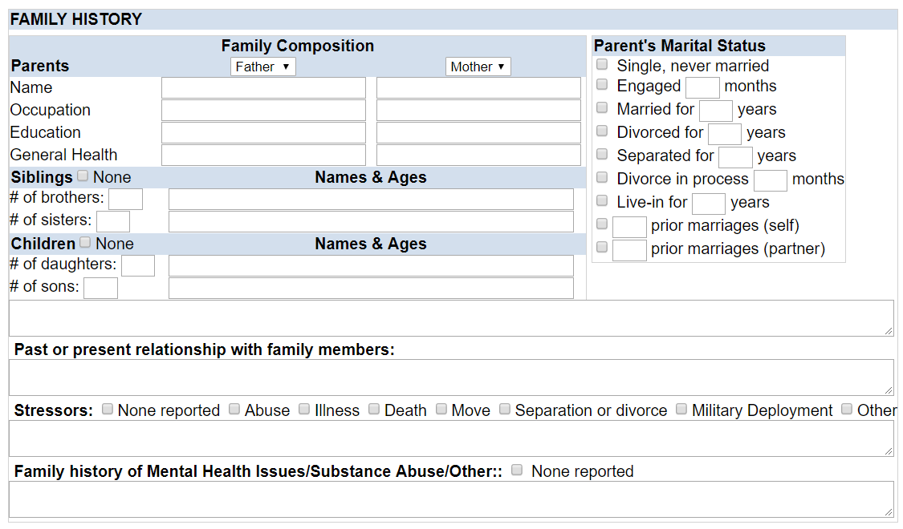

# HTML-CSS-FORM

In this exercise I have created an HTML form that gathers a family history from a patient to later be processed and saved to state and  later persist in a database. 

The basic structure of the code is a table composed of 9 rows. The second-row houses 2 additional nested tables.

I used CSS class and element selectors to style elements that required identical styling. I also used id attributes for all elements that required a value to be captured. I used the camel case naming convention for the id’s in anticipation that this code could easily be integrated with javasript, jQuery, React and all the other JavaScript libraries and of course getElementById( ).

I believe that this exercise tested my skills understanding HTML, CSS selectors, the CSS box model, element attributes, and table nesting and attributes.Good Afternoon Chris,

Below is a screenshot of the form created with HTML and CSS.

